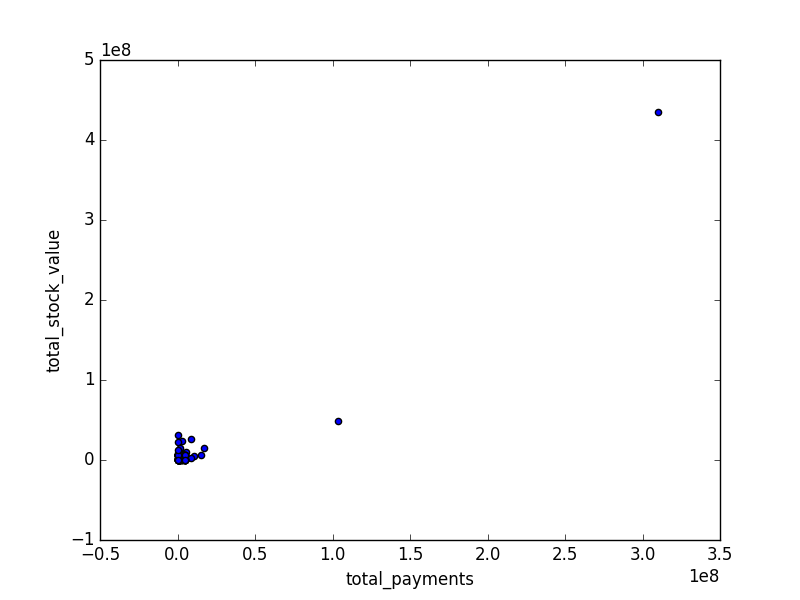
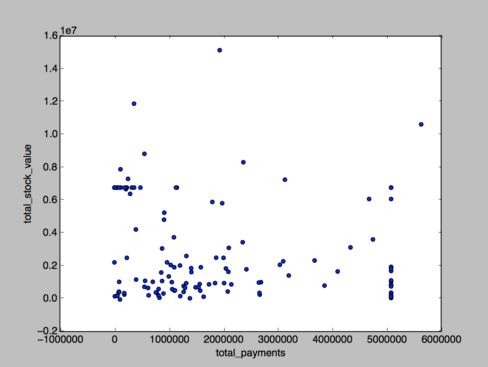

My sub work was done at `README.md`,`project.ipynb(project.html)`. I translated it to `poi_id.py` afterwards. I am grateful to the reviewer.

--------


## 1
>Summarize for us the goal of this project and how machine learning is useful in trying to accomplish it. As part of your answer, give some background on the dataset and how it can be used to answer the project question. Were there any outliers in the data when you got it, and how did you handle those?  [relevant rubric items: “data exploration”, “outlier investigation”]

### Goal

Identify Enron Employees who may have committed fraud based on the public Enron financial and email dataset.

### Why ML helps with this problem

Please think that you have become an audit team to deal with this problem. The data used for this problem contains tens of thousands of mails. How long will it take to grasp this manually?

Also, do not miss the problem, can you inject a lot of resources?

Machine learning solves these problems. Machine learning will find certain regularity from large amounts of data and identify cheaters. Also, you may discover something that people do not notice.

### Allocation across classes (POI/non-POI) and data points

```py
poi = 0
for person in data_dict:
    if data_dict[person]['poi'] == True:
       poi += 1
print("Total number of poi: %i" % poi)
print("Total number of non-poi: %i" % (len(data_dict) - poi))
```

```
Total number of poi: 18
Total number of non-poi: 128
total number of data points: 146
```

### outliers

When visualizing it, it turns out that there are obvious abnormal values. Therefore, I need to remove this abnormal value.
The outlier is the sum of all observations.



remove outliers by IsolationForest methods

```py
X = df.drop(['email_address','poi'], axis=1)
y = df['poi']

from sklearn.ensemble import IsolationForest

clf = IsolationForest(n_estimators=100, max_samples=100)
clf.fit(X)
y_pred = clf.predict(X)
# non_outlier 1, outlier -1
non_outlier = 1
predicted_index = np.where(y_pred == non_outlier)

df = df.iloc[predicted_index]
```



Further visualization later, to eliminate outliers.

```py
df = df[df.from_messages < 4000 ]
df = df[df.exercised_stock_options < 1e7 ]
df = df[df.deferred_income > -2000000 ]
df = df[df.from_poi_to_this_person < 300 ]
df = df[df.loan_advances > 3e7 ]
df = df[df.restricted_stock_deferred > -100000 ]
df = df[df.to_messages < 10000 ]
df = df[df.restricted_stock < 0.6e7 ]
```

### manual detect outliers
**THE TRAVEL AGENCY IN THE PARK is not human**

## 2
>What features did you end up using in your POI identifier, and what selection process did you use to pick them? Did you have to do any scaling? Why or why not? As part of the assignment, you should attempt to engineer your own feature that does not come ready-made in the dataset -- explain what feature you tried to make, and the rationale behind it. (You do not necessarily have to use it in the final analysis, only engineer and test it.) In your feature selection step, if you used an algorithm like a decision tree, please also give the feature importances of the features that you use, and if you used an automated feature selection function like SelectKBest, please report the feature scores and reasons for your choice of parameter values.  [relevant rubric items: “create new features”, “intelligently select features”, “properly scale features”]

### selection process

I removed unnecessary variables, using domain knowledge.For example, email does not affect fraud.

Those with low importance are cut. (Ex 9.39613548e - 02) When trying to cut them, the best K is 10.

`ex`

```py
from sklearn.feature_selection import SelectKBest

y = df["poi"]
X = df.drop("poi",axis=1)
selector = SelectKBest( k=10)
selector.fit(X, y)
mask = selector.get_support()
X_selected = selector.transform(X)
print(selector.scores_)
```

```
[5.03243376e+00 2.42450947e-02 4.41642424e+00 1.34154044e+00
 2.69049117e+00 1.18763148e+00 1.91698610e+00 8.22462167e+00
 9.89504146e-02 7.81650778e-01 2.30728617e+00 8.11185667e-03
 3.61763448e+00 2.39952341e+00 9.39613548e-02 7.86300003e-02
 1.79717686e-01 3.38864856e+00 7.80037331e+00]
```

### the final features list

```py
"bonus"
"deferred_income"
"exercised_stock_options"
"from_messages"
"from_poi_to_this_person"
"other"
"restricted_stock"
"salary"
"total_stock_value"
"fraction_from_poi"
"poi"
```

### manual selection

I chose several features from domain knowledge.

- poi
- from_poi_to_this_person
- from_this_person_to_poi
- shared_receipt_with_poi

**from_poi_to_this_person、from_this_person_to_poi,shared_receipt_with_poi **

The reason for choosing is that people of poi are thinking that they are doing many interactions with people of POI.

### manual vs SelectKBest

Although the accuracy is better in the manual, select K best is better for recall and precision.

`manual`

```
Evaluate KNeighborsClassifier model
accuracy: 0.900571428571
precision: 0.00552631578947
recall:    0.00583333333333
n_neighbors = 2,

Evaluate naive bayes model
accuracy: 0.905142857143
precision: 0.364
recall:    0.234333333333
```

`select K best`

```
Evaluate KNeighborsClassifier model
accuracy: 0.912571428571
precision: 0.477619047619
recall:    0.296666666667
n_neighbors = 2,

Evaluate naive bayes model
accuracy: 0.886571428571
precision: 0.356357142857
recall:    0.289166666667
```

### scaling

I needed to do scaling. This is because the unit of each feature is different. Therefore, it was necessary to look up from the same scale with uniform units.

### Feature Engineering

I did `Feature Engineering` from human intuition.

`People who worked for fraud may be e-mailing more with the person who worked for fraud.`

```py
fraction_from_poi =[]
fraction_to_poi =[]
for key, row in df.iterrows():
    fraction_from_poi.append(row["from_poi_to_this_person"] / row["to_messages"])
    fraction_to_poi.append(row["from_this_person_to_poi"] / row["from_messages"])

df['fraction_from_poi'] = fraction_from_poi
df['fraction_to_poi'] = fraction_to_poi
df.head()
```

## Feature Engineering result

As for the results, finally, I decided to select and use Feature Engineering feature quantities here. The feature used is fraction_from_poi.
It was selected by select K best.

## 3
>What algorithm did you end up using? What other one(s) did you try? How did model performance differ between algorithms?  [relevant rubric item: “pick an algorithm”]

I used SVC and SGD, SVC was better than SVC itself, but SVC did not work well at the time of submission, so I chose SVC.
There is also reason that SVC confirmed the report that does not work well for this problem.

[Got a divide by zero when trying out: SVC](https://discussions.udacity.com/t/got-a-divide-by-zero-when-trying-out-svc/19823)

## 4
>What does it mean to tune the parameters of an algorithm, and what can happen if you don’t do this well?  How did you tune the parameters of your particular algorithm? What parameters did you tune? (Some algorithms do not have parameters that you need to tune -- if this is the case for the one you picked, identify and briefly explain how you would have done it for the model that was not your final choice or a different model that does utilize parameter tuning, e.g. a decision tree classifier).  [relevant rubric items: “discuss parameter tuning”, “tune the algorithm”]

### What does it mean to tune the parameters of an algorithm

In machine learning, the precision varies depending on the numerical value of a parameter in a certain model. This is because we have to construct the most fitting model for the data set. Also, depending on the data set, the optimal parameters are different.

### SGD parameters

#### loss

>The ‘log’ loss gives logistic regression, a probabilistic classifier. ‘modified_huber’ is another smooth loss that brings tolerance to outliers as well as probability estimates. ‘squared_hinge’ is like hinge but is quadratically penalized. ‘perceptron’ is the linear loss used by the perceptron algorithm. The other losses are designed for regression but can be useful in classification as well; see SGDRegressor for a description.

- hinge
- squared_hinge


#### penalty
>The penalty (aka regularization term) to be used. Defaults to ‘l2’ which is the standard regularizer for linear SVM models. ‘l1’ and ‘elasticnet’ might bring sparsity to the model (feature selection) not achievable with ‘l2’.

Since this data set is not sparse, choose the default l2.


#### alpha : float

>Constant that multiplies the regularization term. Defaults to 0.0001 Also used to compute learning_rate when set to ‘optimal’.

- 0.0001
- 0.0002
- 0.001
- 0.01
- 0.1

## 5
>What is validation, and what’s a classic mistake you can make if you do it wrong? How did you validate your analysis?  [relevant rubric items: “discuss validation”, “validation strategy”]

In machine learning, model validation is referred to as the process where a trained model is evaluated with a testing data set.
The testing data set is a separate portion of the same data set from which the training set is derived.
The main purpose of using the testing data set is to test the generalization ability of a trained model (Alpaydin 2010).

Validating data is extremely important.
The reason being is that at times data is not always perfect there can be imbalance within it which leads to skewed or biased results.

### At least two appropriate metrics are used to evaluate algorithm performance (e.g. precision and recall), and the student articulates what those metrics measure in context of the project task.

For this time, I used precision and recall to confirm the performance.

Recall in this context is also referred to as the true positive rate or sensitivity, and precision is also referred to as positive predictive value (PPV); other related measures used in classification include true negative rate and accuracy.

$$
precision=\frac{TP}{TP+FP}
$$

$$
recall=\frac{TP}{TP+FN}
$$

```
TP: Predicted as poi = true, what actually was poi = true
FP = Predicted as poi = false, what actually was poi = false
FN = Predicted as poi = false, But actually was poi = true
```

### Performance of the final algorithm selected is assessed by splitting the data into training and testing sets or through the use of cross validation, noting the specific type of validation performed.

I used Cross Validation train_test_split function to split 30% of my dataset as for testing. then I used sklearn.metrics accuracy, precision and recall scores to validate my algorithms.
Perform cross validation as follows.

```py
def evaluate_clf(grid_search, features, labels, params, iters=100):
    acc = []
    pre = []
    recall = []
    for i in range(iters):
        features_train, features_test, labels_train, labels_test = \
        train_test_split(features, labels, test_size=0.3, random_state=i)
        grid_search.fit(features_train, labels_train)
        predictions = grid_search.predict(features_test)
        acc = acc + [accuracy_score(labels_test, predictions)]
        pre = pre + [precision_score(labels_test, predictions)]
        recall = recall + [recall_score(labels_test, predictions)]
    print "accuracy: {}".format(mean(acc))
    print "precision: {}".format(mean(pre))
    print "recall:    {}".format(mean(recall))
    best_params = grid_search.best_estimator_.get_params()
    for param_name in params.keys():
        print("%s = %r, " % (param_name, best_params[param_name]))
    return grid_search.best_estimator_
```

## 6
>Give at least 2 evaluation metrics and your average performance for each of them.  Explain an interpretation of your metrics that says something human-understandable about your algorithm’s performance. [relevant rubric item: “usage of evaluation metrics”]

In this survey we want to prevent classifying fraud workers as not working wrong. This is to allow for preliminary use of the classification system. Therefore, recall is used for the evaluation function
